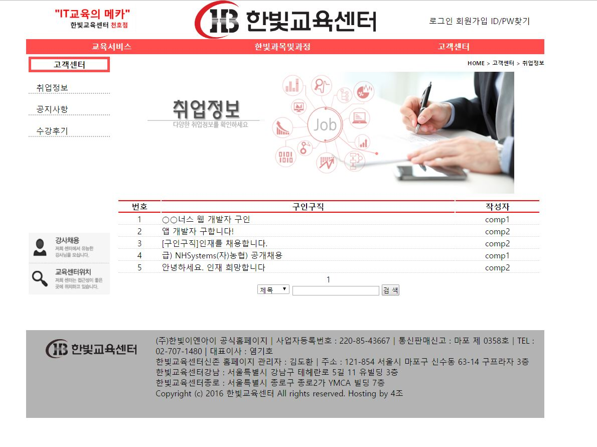
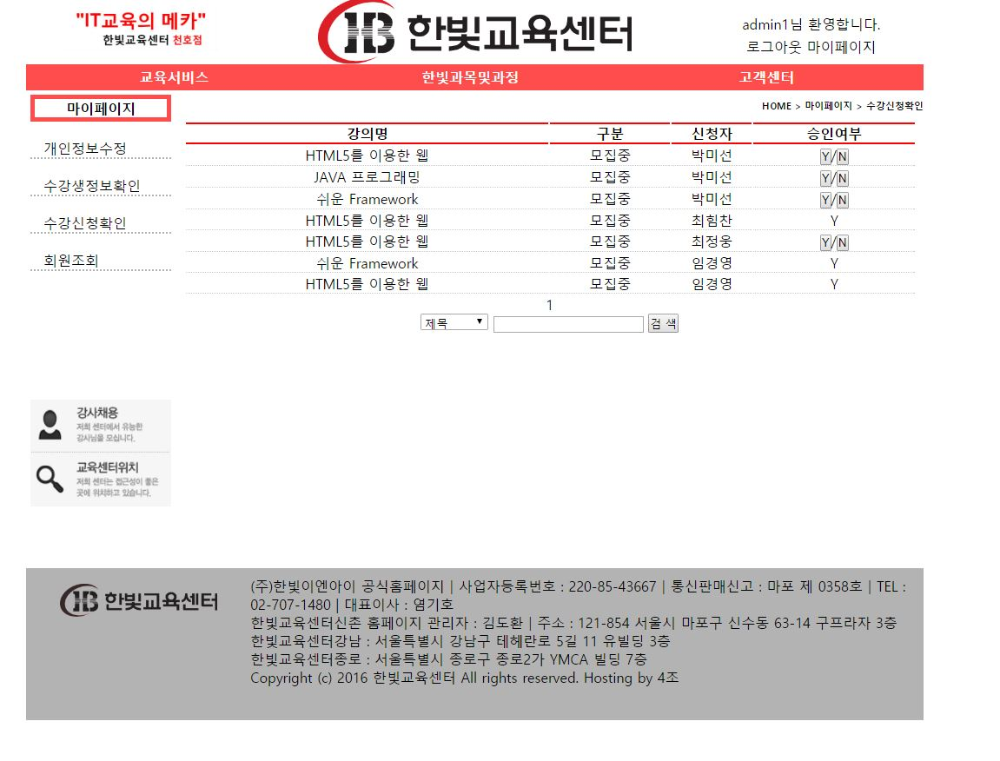
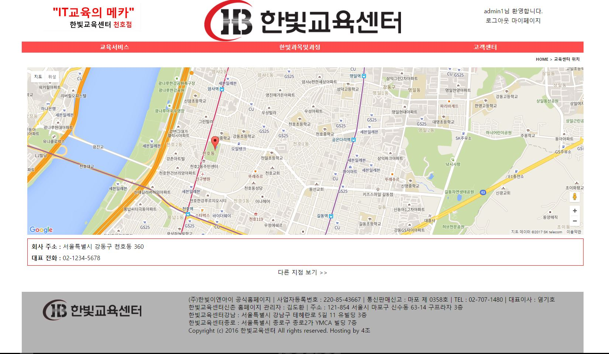

# ProjectLMS [스마트 웹&앱 콘텐츠 개발자과정]
## MVC 패턴을 이용한 웹사이트 제작-한빛교육센터 관리 웹
#### :pencil: 2nd Practice : web project using mvc
##### JAVA를 이용해 back-end 구축 : mvc 패턴 이용
##### oracle DB를 이용해 사용자 정보 저장 
##### JavaScript-html을 이용해 front-end 구축 : 화면 그리드 시스템 적용

***

 > before start
 > 1. chage setting of DB(url, id, password)
 > 2. Tomcat server setting & run

***

#### :camera: run image

 - run
 
 
 

***

#### :blush: check Doc
[인터뷰시나리오](./doc/01.인터뷰시나리오.pdf)  
[시나리오](./doc/02.시나리오.pdf)  
[요구사항명세서](./doc/03.요구사항명세서.pdf)  
[유스케이스](./doc/04.유스케이스.pdf)  
[클래스다이어그램](./doc/05.클래스다이어그램.pdf)  
[시퀀스다이어그램](./doc/06.시퀀스다이어그램.pdf)  
[ERD](./doc/07.ERD.pdf)  
[스토리보드](./doc/08.스토리보드.pdf)  

